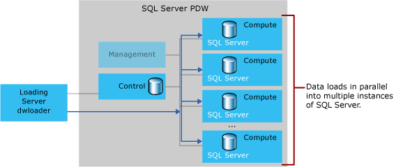

---

title: "Backup and loading hardware overview for APS PDW"
author: "barbkess" 
ms.author: "barbkess"
manager: "jhubbard"	  
ms.prod: "analytics-platform-system" 
ms.technology: "mpp-data-warehouse"
description: "To deploy your end-to-end data warehousing solution on Analytics Platform System (APS) with SQL Server Parallel Data Warehouse (PDW), you need to create a plan for backing up the data warehouse and loading data."
ms.date: "10/20/2016"
ms.topic: "article"

ms.assetid: 3a2ae046-f8d8-4a5c-b3c1-6ecee005df6c
caps.latest.revision: 9

---

# Backup and loading hardware overview
To deploy your end-to-end data warehousing solution on Analytics Platform System (APS) with SQL Server Parallel Data Warehouse (PDW), you need to create a plan for backing up the data warehouse and loading data. Use this guidance to acquire and configure backup and loading servers that will meet your business requirements.  
  
## Acquire and configure backup servers  
  
  
To backup a PDW database, you need one or more backup servers. You can use your own existing hardware or purchase new hardware. For more information, see [Acquire and Configure a Backup Server](acquire-and-configure-backup-server.md). These instructions include a [Backup server capacity planning worksheet](backup-capacity-planning-worksheet.md) to help you plan the right solution for backup.  
  
## Acquire and configure loading servers  
  
  
To load data, you need one or more loading servers. You can use your own existing ETL or other servers, or you can purchase new servers. For more information, see [Acquire and configure a loading server](acquire-and-configure-loading-server.md). These instructions include a [Loading server capacity planning worksheet](loading-server-capacity-planning-worksheet.md) to help you plan the right solution for loading.  
  
## See Also  
[Backup and restore overview](backup-and-restore-overview.md)  
[Load overview](load-overview.md)  
  
