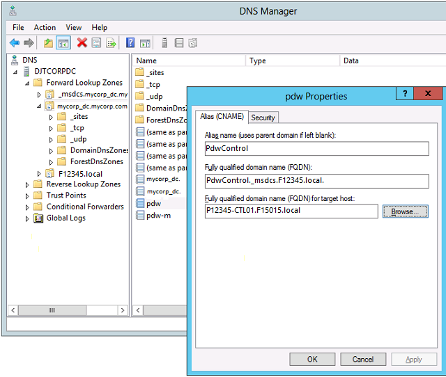
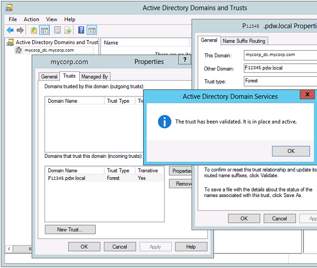

# Configure domain trusts

Perform the following steps to configure Analytics Platform System (APS, also known as SQL Server PDW or PDW) to accept Windows Authentication logins from a corporate domain, and configure a corporate DNS server to provide authentication to APS. For all steps, login as a domain administrator or other high privileged user. This process includes the following steps:

- Configure a Forwarder on PDW DNS
- Configure a Forward Lookup Zone on the Corporate DNS
- Configure a Reverse Lookup Zone on the Corporate DNS
- Add Records for CTL and AD Nodes to the New FLZ on the Corporate DNS Server
- Add SRV Records Needed for Kerberos on the Corporate DNS Server
- Add Aliases for the CTL and AD Nodes to the Corporate DNS
- Create a Trust
- Validate the Trust

## Steps on the SQL Server PDW

**Configure a forwarder on PDW DNS**
1. Log in to appliance_domain-HST01 as the appliance domain administrator.
2. Open the Hyper-V Manager program (virtmgmt.msc).
   - Connect to appliance_domain-HST01, if not connected by default.
   - In the Virtual Machines pane, right-click appliance_domain-AD01, and click Connect.
   - Log on to the appliance_domain-AD01 as the appliance domain administrator.

3. While on appliance_domain-AD01, open the DNS Manager (dnsmgmt.msc).
4. Right-click your DNS Server (appliance_domain-AD01), and then click Properties. 
5. On the Advanced tab, clear the checkbox for Disable recursion (also disables forwarders) to permit forwarders, and then click Apply.
6. On the Forwarders tab, click Edit.
7. In the Edit Forwarders dialog box, type the IP address of the DNS server for the corporate domain that will provide authentication.
8. Click OK to close the Edit Forwarders dialog box, and OK to close the DNS Properties dialog box.
9. While on appliance_domain-HST01, go back to the Hyper-V Manager. 
   - Connect to appliance_domain-HST02, if not connected by default. 
   - In the Virtual Machines pane, right-click
   - Log on to the appliance_domain-AD02 as the appliance domain administrator.
   - While on appliance_domain-AD02, perform steps 3 – 8 above.

## Steps to Set Up Active Directory and DNS on the Corporate Domain

**Configure a Forward Lookup Zone (FLZ) on the Corporate DNS**
1. Open the DNS Manager (dnsmgmt.msc) on a corporate DC of the domain that will provide authentication.
2. In the left pane, expand the DNS Server for the authenticating domain, right-click Forward Lookup Zones, and then click New Zone.
3. Complete the New Zone Wizard to create a Primary zone using the name of the appliance domain as the Zone Name. The name will be in the format: F12345.pdw.local where F12345 is the appliance domain. See your domain administrator for the preferred selection for the other options.

> [!TIP] 
> At this point you should be able to successfully use ping to connect to the IP addresses of the SQL Server PDW management and control nodes, in the format ping xxx.xxx.xxx.xxx
 

**Configure a Reverse Lookup Zone (RLZ) on the Corporate DNS**
1. Continue using the DNS Manager on a corporate DC of the domain that will provide authentication. In the left pane, expand the DNS Server for the authenticating domain, right-click Reverse Lookup Zones, and then click New Zone.

2. Complete the New Zone Wizard to create a Primary zone, and specifying an IPv4 Reverse Lookup Zone. In the Network ID box, provide enough of the IP address to indicate the IP addresses that belong to this zone. (Typically this will be the first 3 octets of the SQL Server PDW IP addresses.) See your domain administrator for the preferred selection for the other options or if your IP addresses are not typical.

**Add Records for CTL and Appliance AD Nodes to the New FLZ on the Corporate DNS Server**
1. Continue using the DNS Manager on a corporate DC of the domain that will provide authentication. In the left-pane, expand Forward Lookup Zones, and then right-click on the new FLZ of SQL Server PDW (that you created in a previous step), and then click New Host (A or AAAA).
   - In the New Host dialog box, in the Name box, type the name of the PDW control node, in the format PDW_region-ctl01, such as P12345-ctl01.
   - In the IP address box, type the external IP address of the control node.
   - Check the Create associated pointer (PTR) record box.
   - Click Add Host to create a reverse lookup entry for the control node.
2. Repeat the New Host process to create a pointer record for both appliance_domain-AD01 and appliance_domain-AD02.

> [!TIP]
> At this point you should be able to successfully use ping to connect to the FQDN's of the SQL Server PDWControl node, appliance_domain-AD01, and appliance_domain-AD02, by using the following ping commands: ping PDW_region-CTL01.appliance_domain.local, ping appliance_domain-AD01.appliance_domain.local, ping appliance_domain-AD02.appliance_domain.local

**Add SRV Records Needed for Kerberos on the Corporate DNS Server**

1. Continue using the DNS Manager on a corporate DC of the domain that will provide authentication. Right-click on the FLZ for PDW created earlier, and then click New Domain.
2. In the New DNS Domain dialog box, type dc._msdcs, and then click OK.
3. In the left-pane, expand Forward Lookup Zones, expand your PDW zone name, expand _msdcs node, right click dc, and click Other New Records.
4. In the Resource Record Type dialog box, click Service Location (SRV), and then click Create Record.
5. In the Service box, select _ldap, and in the Host offering this service box, enter the full DNS name of the appliance_domain-AD01 node, suffixed by a dot. For example, F12345-AD01.F12345.pdw.local. Click OK.
6. In the Resource Record Type dialog box, click Service Location (SRV), and then click Create Record.
7. In the Service box, select _kerberos, and in the Host offering this service box, enter the full DNS name of the appliance_domain-AD01 node, suffixed by a dot. For example, F12345-AD01.F12345.pdw.local. Click OK.
8. To close the Resource Record Type dialog box, click Done.
9. Repeat steps 4 – 8 to create _ldap and _kerberos records for appliance_domain-AD02.

**Add Aliases for the CTL and AD Nodes to the Corporate DNS**
1. Continue using the DNS Manager on a corporate DC of the domain that will provide authentication. Right-click on the a FLZ of the authenticating corporate domain, and then click New Alias (CNAME).
2. In the New Resource Record dialog box, in the Alias name box, type the name that you wish to use for the control node. This example uses PdwControl.
3. In the Fully qualified domain name (FQDN) for target host box, type the full internal name of the control node, or click Browse to find it on the DNS (in the FLZ with the SQL Server PDW appliance domain name).
4. In the New Resource Record dialog box, in the Alias name box, type the name that you wish to use for the appliance_domain-AD01. This example uses FabAd01.
5. In the Fully qualified domain name (FQDN) for target host box, type the full internal name of the appliance_domain-AD01, or click Browse to find it on the DNS (in the FLZ with the SQL Server PDW appliance domain name).
6. Repeat steps 4 – 6 for the appliance_domain-AD02 to create a FabAd02 alias.

> [!NOTE]
> These aliases should be used when accessing the PDW from corporate domain.

> [!TIP]
> At this point you should be able to successfully use ping to connect to the alias names of the SQL Server PDW Control and Active Directory nodes, in the format ping PdwControl and ping FabAd01 and ping FabAD02

**Create a Trust**
1. On a corporate domain controller, open Active Directory Domains and Trusts (domain.msc).
2. In the left pane, right-click on the domain name, and then click Properties.
3. On the Trusts tab, click New Trust, and then complete the New Trust Wizard providing appliance domain administrator credentials when asked.
   - For Trust Name enter the fully qualified appliance domain name, in the format F1234.pdw.local
   - Choose a Forest trust.
   - Choose One-way: incoming.
   - Choose Both this domain and the specified domain. You will be prompted for administrator credentials on the appliance domain.
   - In most cases choose Forest-wide authentication. Choose Selective 

> [!NOTE]
> A Two-way trust can be created but it is not necessary.

**Validate the Trust**
1. Select the new trust in the list of incoming trusts, and then click Properties. Click Validate.
2. Choose Yes, validate the incoming trust and enter appliance domain administrator credentials.

