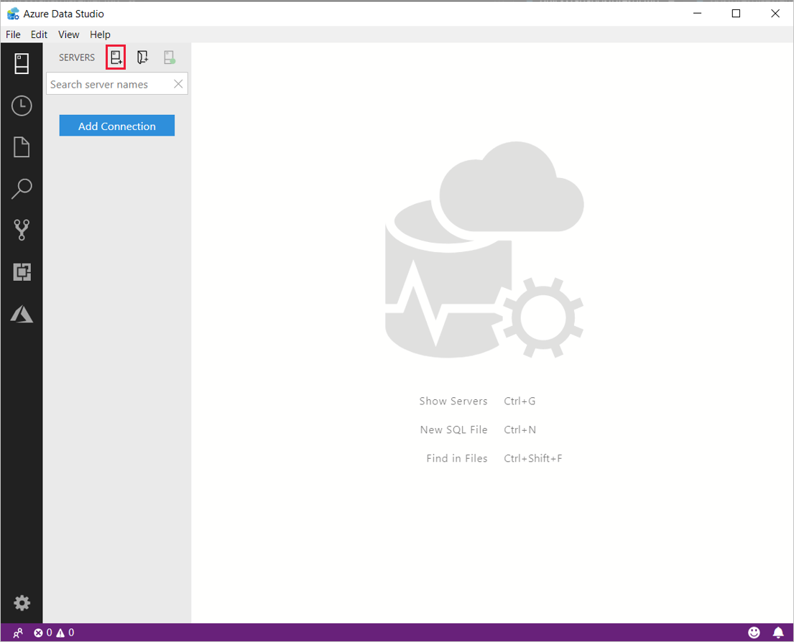
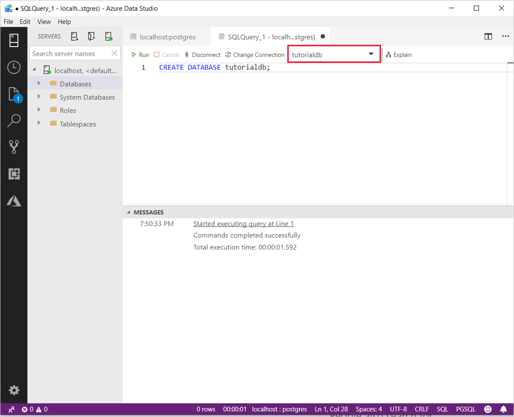
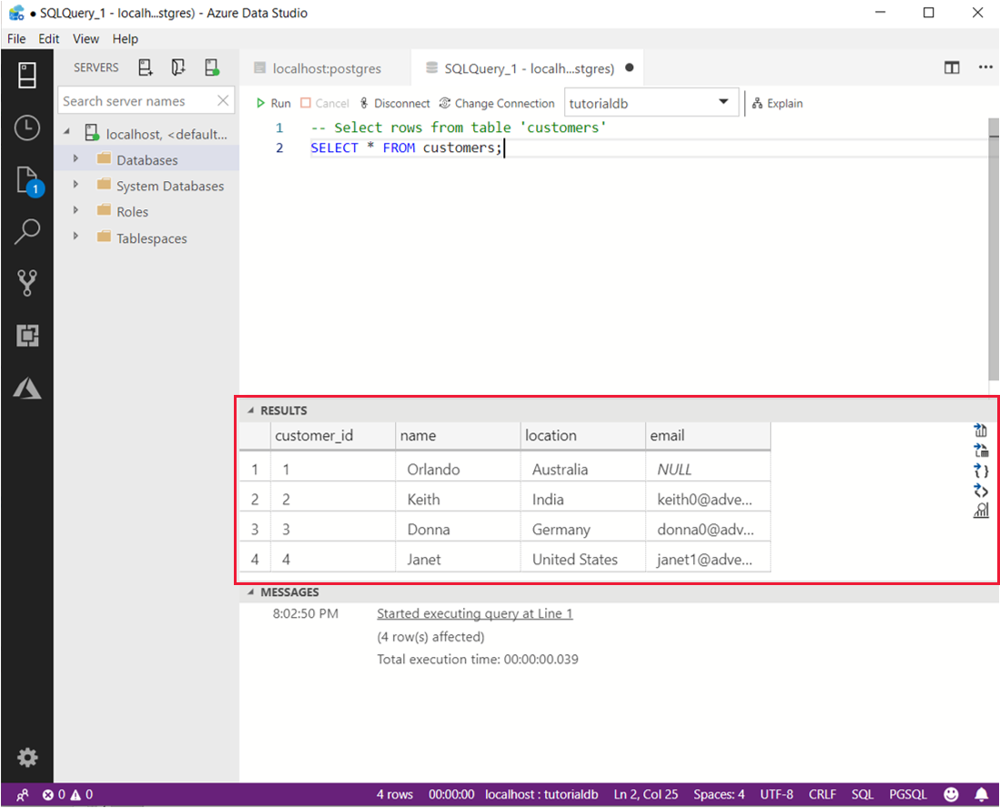

# Quickstart: Use Azure Data Studio to connect and query PostgreSQL

This quickstart shows how to use Azure Data Studio to connect to PostgreSQL, and then use SQL statements to create the database *tutorialdb* and query it.

## Prerequisites

To complete this quickstart, you need Azure Data Studio, the PostgreSQL extension for Azure Data Studio, and access to a PostgreSQL server.

- [Install Azure Data Studio](./download-azure-data-studio.md).
- [Install the PostgreSQL extension for Azure Data Studio](./extensions/postgres-extension.md).
- [Install PostgreSQL](https://www.postgresql.org/download/). (Alternatively, you can create a Postgres database in the cloud using [az postgres up](/azure/postgresql/quickstart-create-server-up-azure-cli)). 

## Connect to PostgreSQL

1. Start **Azure Data Studio**.

2. The first time you start Azure Data Studio the **Connection** dialog opens. If the **Connection** dialog doesn't open, click the **New Connection** icon in the **SERVERS** page:

   

3. In the form that pops up, go to **Connection type** and select **PostgreSQL** from the drop-down.


4. Fill in the remaining fields using the server name, user name, and password for your PostgreSQL server. 

     

   | Setting       | Example value | Description |
   | ------------ | ------------------ | ------------------------------------------------- | 
   | **Server name** | localhost | The fully qualified server name |
   | **User name** | postgres | The user name you want to log in with. |
   | **Password (SQL Login)** | *password* | The password for the account you are logging in with. |
   | **Password** | *Check* | Check this box if you don't want to enter the password each time you connect. |
   | **Database name** | \<Default\> | Fill this if you want the connection to specify a database. |
   | **Server group** | \<Default\> | This option lets you assign this connection to a specific server group you create. | 
   | **Name (optional)** | *leave blank* | This option lets you specify a friendly name for your server. | 

5. Select **Connect**. 

After successfully connecting, your server opens in the **SERVERS** sidebar.


## Create a database

The following steps create a database named **tutorialdb**:

1. Right-click on your PostgreSQL server in the **SERVERS** sidebar and select **New Query**.

2. Paste this SQL statement in the query editor that opens up.

   ```sql
   CREATE DATABASE tutorialdb;
   ```

3. From the toolbar select **Run** to execute the query. Notifications appear in the **MESSAGES** pane to show query progress.

>[!TIP]
> You can use **F5** on your keyboard to execute the statement instead of using **Run**.

After the query completes, right-click **Databases** and select **Refresh** to see **tutorialdb** in the list under the **Databases** node.


## Create a table

 The following steps create a table in the **tutorialdb**:

1. Change the connection context to **tutorialdb** using the drop-down in the query editor. 

   

2. Paste the following SQL statement into the query editor and click **Run**. 

   > [!NOTE]
   > You can either append this or overwrite the existing query in the editor. Clicking **Run** executes only the query that is highlighted. If nothing is highlighted, clicking **Run** executes all queries in the editor.

   ```sql
   -- Drop the table if it already exists
   DROP TABLE IF EXISTS customers;
   -- Create a new table called 'customers'
   CREATE TABLE customers(
       customer_id SERIAL PRIMARY KEY,
       name VARCHAR (50) NOT NULL,
       location VARCHAR (50) NOT NULL,
       email VARCHAR (50) NOT NULL
   );
   ```

## Insert rows

Paste the following snippet into the query window and click **Run**:

   ```sql
   -- Insert rows into table 'customers'
   INSERT INTO customers
       (customer_id, name, location, email)
    VALUES
      ( 1, 'Orlando', 'Australia', ''),
      ( 2, 'Keith', 'India', 'keith0@adventure-works.com'),
      ( 3, 'Donna', 'Germany', 'donna0@adventure-works.com'),
      ( 4, 'Janet', 'United States','janet1@adventure-works.com');
   ```

## Query the data

1. Paste the following snippet into the query editor and click **Run**:
   
   ```sql
   -- Select rows from table 'customers'
   SELECT * FROM customers; 
   ```

2. The results of the query are displayed:

   

## Next Steps

Learn about the [scenarios available for Postgres in Azure Data Studio](./extensions/postgres-extension.md).
