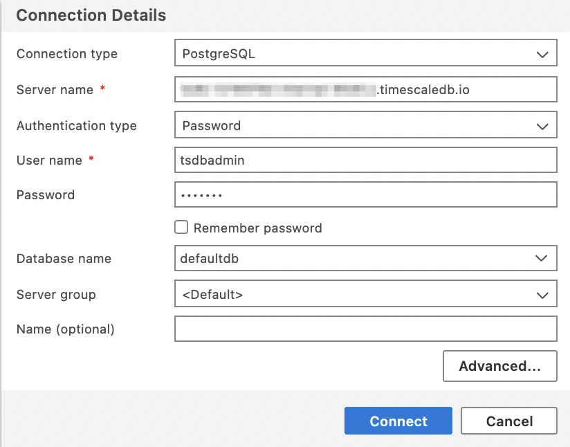

# Quickstart: Use Azure Data Studio to connect and query Managed Service for TimescaleDB on Azure

This quickstart shows how to use Azure Data Studio to connect to Managed Service for TimescaleDB on Azure, and then use SQL statements to create a hypertable and query it.

## Prerequisites

To complete this quickstart, you need Azure Data Studio, the PostgreSQL extension for Azure Data Studio, and access to a Managed Service for TimescaleDB on Azure server.

- [Install Azure Data Studio](./download-azure-data-studio.md).
- [Install the PostgreSQL extension for Azure Data Studio](./extensions/postgres-extension.md).
- [Create a Managed Service for TimescaleDB on Azure](https://docs.timescale.com/install/latest/installation-mst/#create-your-first-service).
- Make a note of the **Host**, **Port**, **Database Name**, **User**, and **Password** for Managed Service for TimescaleDB service on Azure.

## Connect to Managed Service for TimescaleDB on Azure

1. Start **Azure Data Studio**.

2. The first time you start Azure Data Studio the **Connection** dialog opens. If the **Connection** dialog doesn't open, click the **New Connection** icon in the **SERVERS** page:

   

3. In the form that pops up, go to **Connection type** and select **PostgreSQL** from the drop-down.

4. Fill in the remaining fields using the host, port, user, database name, and password for your Managed Service for TimescaleDB on Azure.

     

   | Setting       | Example value | Description |
   | ------------ | ------------------ | ------------------------------------------------- |
   | **Server name** | <REMOTE_HOST>.timescaledb.io | The host name of your Managed Service for TimescaleDB service. |
   | **Authentication type** | Password | The authentication type to log in with |
   | **User name** | tsdbadmin | The user name you want to log in with. |
   | **Password (SQL Login)** | *password* | The password for the account you are logging in with. |
   | **Password** | *Check* | Check this box if you don't want to enter the password each time you connect. |
   | **Database name** | defaultdb | The default database for Managed Service for TimescaleDB service is defaultdb. You can also specify the name of the databse to connect to. |
   | **Server group** | \<Default\> | This option lets you assign this connection to a specific server group you create. |
   | **Name (optional)** | *leave blank* | This option lets you specify a friendly name for your server. |

5. Click **Advanced**.
6. In the **Port** field, type the port number, and click **OK**.
7. Select **Connect**.

After successfully connecting, your server opens in the **SERVERS** sidebar.

## Create a hypertable

 The following steps create a hypertable in the default **defaultdb** database:

1. In the **SERVERS** sidebar, right-click the server and select **New Query**.

1. Paste the following SQL statement into the query editor and click **Run**.

   > [!NOTE]
   > You can either append this or overwrite the existing query in the editor. Clicking **Run** executes only the query that is highlighted. If nothing is highlighted, clicking **Run** executes all queries in the editor.

   ```sql
   CREATE TABLE conditions ( -- create a regular table
   time         TIMESTAMPTZ       NOT NULL,
   location     TEXT              NOT NULL,
   temperature  DOUBLE PRECISION  NULL);
   SELECT create_hypertable('conditions', 'time'); -- turn it into a hypertable
   ```

## Insert rows

Paste the following snippet into the query window and click **Run**:

   ```sql
   INSERT INTO conditions
   VALUES
     (NOW(), 'office', 70.0),
     (NOW(), 'basement', 66.5),
     (NOW(), 'garage', 77.0);
   ```

## Query the data

1. Paste the following snippet into the query editor and click **Run**:

   ```sql
   -- Select rows from hypertable 'conditions'
   SELECT * FROM conditions; 
   ```

2. The results of the query are displayed:

   

## Next Steps

Learn about the [scenarios available for Postgres in Azure Data Studio](./extensions/postgres-extension.md).
