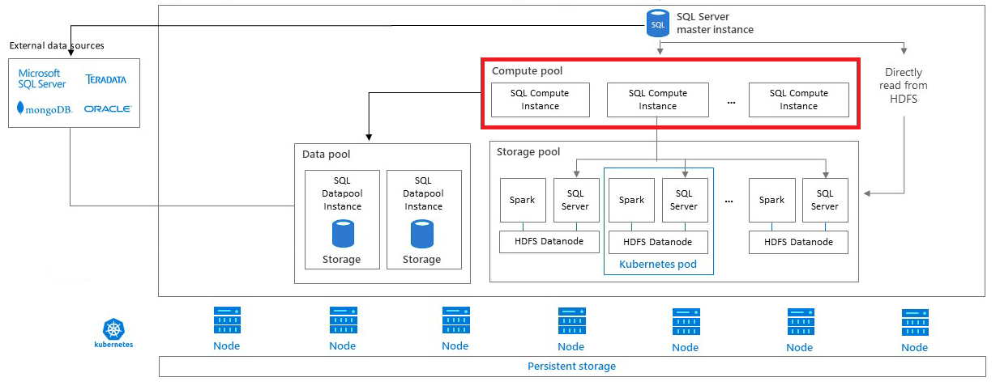

# Introducing compute pools in [!INCLUDE[big-data-clusters-2019](../includes/ssbigdataclusters-ss-nover.md)]

[!INCLUDE[SQL Server 2019](../includes/applies-to-version/sqlserver2019.md)]

[!INCLUDE[big-data-clusters-banner-retirement](../includes/bdc-banner-retirement.md)]

This article describes the role of *SQL Server compute pools* in a SQL Server big data cluster. Compute pools provide scale-out computational resources for a SQL Server big data cluster. They are used to offload computational work, or intermediate result sets, from the SQL Server master instance. The following sections describe the architecture, functionality and usage scenarios of a compute pool.

You can also watch this 5-minute video for an introduction into compute pools:

> [!VIDEO https://channel9.msdn.com/Shows/Data-Exposed/Overview-Big-Data-Cluster-Compute-Pool/player?WT.mc_id=dataexposed-c9-niner]

## Compute pool architecture

A compute pool is made of one or more compute pods running in Kubernetes. The automated creation and management of these pods is coordinated by the [SQL Server master instance](concept-master-instance.md). Each pod contains a set of base services and an instance of the SQL Server database engine.

## Scale-out groups

A compute pool can act as a PolyBase scale-out group for distributed queries over different external data sources such as SQL Server, Oracle, MongoDB, Teradata and HDFS. By using compute pods in Kubernetes, a SQL Server big data cluster can automate creating and configuring compute pods for PolyBase scale-out groups.

## Compute pool scenarios

Scenarios where the compute pool is used include:

- When queries submitted to the master instance use one or more tables located in the [storage pool](concept-storage-pool.md).

- When queries submitted to the master instance use one or more tables with round-robin distribution located in the [data pool](concept-data-pool.md).

- When queries submitted to the master instance use **partitioned** tables with external data sources of SQL Server, Oracle, MongoDB, and Teradata. For this scenario, the query hint OPTION (FORCE SCALEOUTEXECUTION) must be enabled.

- When queries submitted to the master instance use one or more tables located in [HDFS tiering](hdfs-tiering.md).

Scenarios where the compute pool is **not** used include:

- When queries submitted to the master instance use one or more tables in an external Hadoop HDFS cluster.

- When queries submitted to the master instance use one or more tables in Azure Blob Storage.

- When queries submitted to the master instance use **non-partitioned** tables with external data sources of SQL Server, Oracle, MongoDB, and Teradata.

- When the query hint OPTION (DISABLE SCALEOUTEXECUTION) is enabled.

- When queries submitted to the master instance apply to databases located on the master instance.

## Next steps

To learn more about the [!INCLUDE[big-data-clusters-2019](../includes/ssbigdataclusters-ss-nover.md)], see the following resources:

- [Introducing [!INCLUDE[big-data-clusters-2019](../includes/ssbigdataclusters-ver15.md)]](big-data-cluster-overview.md)
- [Workshop: Microsoft [!INCLUDE[big-data-clusters-2019](../includes/ssbigdataclusters-ss-nover.md)] Architecture](https://github.com/microsoft/sqlworkshops-bdc)
