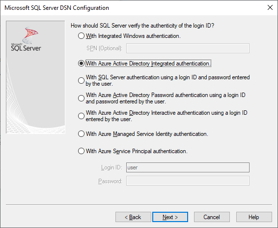
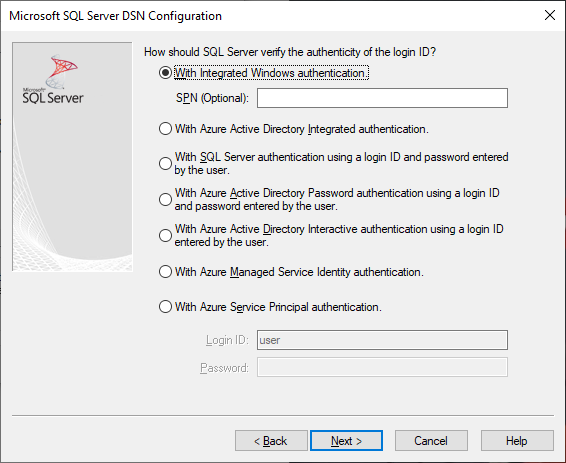
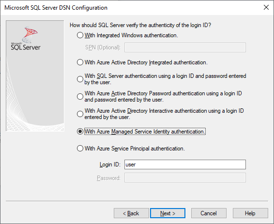
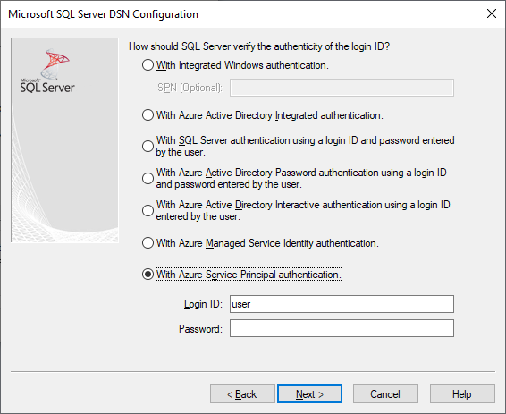
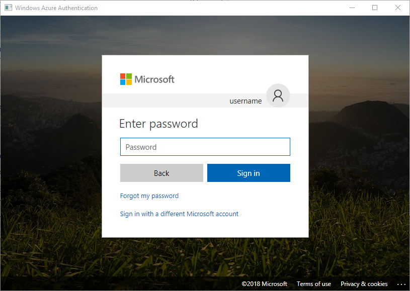

# Using Microsoft Entra ID with the ODBC Driver

[!INCLUDE[Driver_ODBC_Download](../../includes/driver_odbc_download.md)]

[!INCLUDE [entra-id](../../includes/entra-id-hard-coded.md)]

## Purpose

The Microsoft ODBC Driver for SQL Server version 13.1 and above allows ODBC applications to connect to Azure SQL Database or Azure SQL Managed Instance using identities in Microsoft Entra ID. Authentication can be done with a username and password, a Microsoft Entra access token, a Microsoft Entra managed identity (17.3+), or Integrated Windows Authentication in a [federated](/azure/active-directory/hybrid/connect/whatis-fed), domain-joined environment (17.6+ on Linux/macOS). For the ODBC Driver version 13.1, Microsoft Entra access token authentication is _Windows only_. The ODBC Driver version 17 and above support this authentication across all platforms (Windows, Linux, and macOS). A new Microsoft Entra interactive authentication method, which supports multifactor authentication, is introduced in ODBC Driver version 17.1 for Windows. A new Microsoft Entra managed identity authentication method was added in ODBC Driver version 17.3.1.1 for both system-assigned and user-assigned managed identities. All of these options are accomplished by using new DSN and connection string keywords, and connection attributes.

To use Microsoft Entra authentication, you must configure your Azure SQL data source. For more information, see [Configure and manage Microsoft Entra authentication with Azure SQL](/azure/azure-sql/database/authentication-aad-configure).

> [!NOTE]
> The ODBC Driver on Linux and macOS before version 17.6 only supports Microsoft Entra authentication directly against Microsoft Entra ID. If you are using Microsoft Entra username/password authentication from a Linux or macOS client and your Microsoft Entra configuration requires the client to authenticate against an Microsoft Entra Federation Services endpoint, authentication may fail. As of driver version 17.6, this limitation has been removed.

## New and/or Modified DSN and Connection String Keywords

The `Authentication` keyword can be used when connecting with a DSN or connection string to control the authentication mode. The value set in the connection string overrides that in the DSN, if provided. The _pre-attribute value_ of the `Authentication` setting is the value computed from the connection string and DSN values.

|Name|Values|Default|Description|
|-|-|-|-|
|`Authentication`|(not set)|(not set)|Authentication mode determined by other keywords (existing legacy connection options.)|
|`Authentication`|(empty string)|(not set)|(Connection string only.) Override and unset an `Authentication` value set in the DSN.|
|`Authentication`|`SqlPassword`|(not set)|Directly authenticate to SQL using a username and password.|
|`Authentication`|`ActiveDirectoryPassword`|(not set)|Authenticate with a Microsoft Entra identity using a username and password.|
|`Authentication`|`ActiveDirectoryIntegrated`|(not set)|_Windows, and Linux/Mac 17.6+, driver only_. Authenticate with a Windows credential federated through Microsoft Entra ID with integrated authentication.|
|`Authentication`|`ActiveDirectoryInteractive`|(not set)|_Windows driver only_. Authenticate with a Microsoft Entra identity using interactive authentication.|
|`Authentication`|`ActiveDirectoryMsi`|(not set)|Authenticate with a Microsoft Entra managed identity. For user-assigned identity, UID is set to the object ID of the user identity. For system-assigned identity, UID isn't required.|
|`Authentication`|`ActiveDirectoryServicePrincipal`|(not set)|(17.7+) Authenticate with a Microsoft Entra  service principal. UID is set to the client ID of the service principal. PWD is set to the client secret.|
|`Encrypt`|(not set), `Yes`/`Mandatory`(18.0+), `No`/`Optional`(18.0+), `Strict`(18.0+)|(see description)|Controls encryption for a connection. If the pre-attribute value of the `Authentication` setting isn't _`none`_ in the DSN or connection string, the default is `Yes`. The default is also `Yes` in versions 18.0.1+. Otherwise, the default is `No`. If the attribute `SQL_COPT_SS_AUTHENTICATION` overrides the pre-attribute value of `Authentication`, explicitly set the value of Encryption in the DSN or connection string or connection attribute. The pre-attribute value of Encryption is `Yes` if the value is set to `Yes` in either the DSN or connection string.|

## New and/or Modified Connection Attributes

The following pre-connect connection attributes have either been introduced or modified to support Microsoft Entra authentication. When a connection attribute has a corresponding connection string or DSN keyword and is set, the connection attribute takes precedence.

|Attribute|Type|Values|Default|Description|
|-|-|-|-|-|
|`SQL_COPT_SS_AUTHENTICATION`|`SQL_IS_INTEGER`|`SQL_AU_NONE`, `SQL_AU_PASSWORD`, `SQL_AU_AD_INTEGRATED`, `SQL_AU_AD_PASSWORD`, `SQL_AU_AD_INTERACTIVE`, `SQL_AU_AD_MSI`, `SQL_AU_AD_SPA`, `SQL_AU_RESET`|(not set)|See description of `Authentication` keyword above. `SQL_AU_NONE` is provided to explicitly override a set `Authentication` value in the DSN and/or connection string, while `SQL_AU_RESET` unsets the attribute if it was set, allowing the DSN or connection string value to take precedence.|
|`SQL_COPT_SS_ACCESS_TOKEN`|`SQL_IS_POINTER`|Pointer to `ACCESSTOKEN` or NULL|NULL|If non-null, specifies the Microsoft Entra access token to use. It's an error to specify an access token and also `UID`, `PWD`, `Trusted_Connection`, or `Authentication` connection string keywords or their equivalent attributes. <br> **NOTE:** ODBC Driver version 13.1 only supports this setting on _Windows_.|
|`SQL_COPT_SS_ENCRYPT`|`SQL_IS_INTEGER`|`SQL_EN_OFF`, `SQL_EN_ON`|(see description)|Controls encryption for a connection. `SQL_EN_OFF` and `SQL_EN_ON` disable and enable encryption, respectively. If the pre-attribute value of the `Authentication` setting isn't _`none`_ or `SQL_COPT_SS_ACCESS_TOKEN` is set, and `Encrypt` wasn't specified in either the DSN or connection string, the default is `SQL_EN_ON`. Otherwise, the default is `SQL_EN_OFF`. If the connection attribute `SQL_COPT_SS_AUTHENTICATION` is set to not _`none`_, explicitly set `SQL_COPT_SS_ENCRYPT` to the desired value if `Encrypt` wasn't specified in the DSN or connection string. The effective value of this attribute controls [whether encryption is used for the connection.](../../relational-databases/native-client/features/using-encryption-without-validation.md)|
|`SQL_COPT_SS_OLDPWD`|\-|\-|\-|Not supported with Microsoft Entra ID, since password changes to Microsoft Entra principals can't be accomplished through an ODBC connection. <br><br>Password expiration for SQL Server Authentication was introduced in SQL Server 2005. The `SQL_COPT_SS_OLDPWD` attribute was added to allow the client to provide both the old and the new password for the connection. When this property is set, the provider won't use the connection pool for the first connection or for future connections, since the connection string contains the "old password", which has now changed.|
|`SQL_COPT_SS_INTEGRATED_SECURITY`|`SQL_IS_INTEGER`|`SQL_IS_OFF`,`SQL_IS_ON`|`SQL_IS_OFF`|_Deprecated_; use `SQL_COPT_SS_AUTHENTICATION` set to `SQL_AU_AD_INTEGRATED` instead. <br><br>Forces use of Windows Authentication (Kerberos on Linux and macOS) for access validation on server login. When Windows Authentication is used, the driver ignores user identifier and password values provided as part of `SQLConnect`, `SQLDriverConnect`, or `SQLBrowseConnect` processing.|

<a name='ui-additions-for-azure-active-directory-windows-driver-only'></a>

## UI Additions for Microsoft Entra ID (Windows driver only)

The DSN setup and connection UIs of the driver have been enhanced with the extra options necessary to authenticate with Microsoft Entra ID.

### Creating and editing DSNs in the UI

It's possible to use Microsoft Entra authentication options when creating or editing an existing DSN using the driver's setup UI:

`Authentication=ActiveDirectoryIntegrated` for Microsoft Entra integrated authentication to Azure SQL



`Authentication=ActiveDirectoryPassword` for Microsoft Entra username/password authentication to Azure SQL 


`Authentication=ActiveDirectoryInteractive` for Microsoft Entra interactive authentication to Azure SQL


> [!NOTE]
> As of driver version 17.9, the interactive authentication behavior has changed. Users will always be prompted for credentials unless the driver has a valid access token cached. This change prevents users on Microsoft Entra joined devices from skipping the prompt and automatically signing in with cached credentials when using `ActiveDirectoryInteractive` authentication.

`Authentication=SqlPassword` for username/password authentication to SQL Server and Azure SQL


`Trusted_Connection=Yes` for Windows legacy SSPI-integrated authentication



`Authentication=ActiveDirectoryMsi` for Microsoft Entra managed identity authentication



`Authentication=ActiveDirectoryServicePrincipal` for Microsoft Entra service principal authentication



The seven options correspond to `Trusted_Connection=Yes` (existing legacy Windows SSPI-only integrated authentication) and `Authentication=` `ActiveDirectoryIntegrated`, `SqlPassword`, `ActiveDirectoryPassword`, `ActiveDirectoryInteractive`, `ActiveDirectoryMsi`, and `ActiveDirectoryServicePrincipal` respectively.

### SQLDriverConnect Prompt (Windows driver only)

The prompt dialog displayed by SQLDriverConnect when it requests information required to complete the connection contains four new options for Microsoft Entra authentication:


These options correspond to the same six available in the DSN setup UI above.

### Example connection strings

1. SQL Server Authentication - legacy syntax. Server certificate isn't validated, and encryption is used only if the server enforces it. The username/password is passed in the connection string.

   `server=Server;database=Database;UID=UserName;PWD=Password;Encrypt=no;TrustServerCertificate=yes;`

2. SQL Authentication - new syntax. The client requests encryption (the default value of `Encrypt` is `true`) and the server certificate gets validated, whatever the encryption setting (unless `TrustServerCertificate` is set to `true`). The username/password is passed in the connection string.

   `server=Server;database=Database;UID=UserName;PWD=Password;Authentication=SqlPassword;`

3. Integrated Windows Authentication (Kerberos on Linux and macOS) using SSPI (to SQL Server or SQL IaaS) - current syntax. Server certificate isn't validated, unless encryption is required by the server.

   `server=Server;database=Database;Trusted_Connection=yes;Encrypt=no;`

4. (_Windows driver only_.) Integrated Windows Authentication using SSPI (if the target database is in SQL Server or SQL Server on Azure VMs) - new syntax. The client requests encryption (the default value of `Encrypt` is `true`) and the server certificate gets validated, whatever the encryption setting (unless `TrustServerCertificate` is set to `true`).

   `server=Server;database=Database;Authentication=ActiveDirectoryIntegrated;`

5. Microsoft Entra username/password authentication (if the target database is in Azure SQL Database or Azure SQL Managed Instance). Server certificate gets validated, whatever the encryption setting (unless `TrustServerCertificate` is set to `true`). The username/password is passed in the connection string.

   `server=Server;database=Database;UID=UserName;PWD=Password;Authentication=ActiveDirectoryPassword;Encrypt=yes;`

6. (_Windows, and Linux/macOS 17.6+, driver only_.) Integrated Windows Authentication using ADAL or Kerberos, which involves redeeming Windows account credentials for a Microsoft Entra access token, assuming the target database is in Azure SQL. Server certificate gets validated, whatever the encryption setting (unless `TrustServerCertificate` is set to `true`). On Linux/macOS, a suitable Kerberos ticket needs to be available. For more information, see the section below on Federated Accounts and [Using Integrated Authentication](linux-mac/using-integrated-authentication.md).

   `server=Server;database=Database;Authentication=ActiveDirectoryIntegrated;Encrypt=yes;`

7. (_Windows driver only_.) Microsoft Entra Interactive Authentication uses Microsoft Entra multifactor authentication technology to set up connection. In this mode, by providing the login ID, an Azure Authentication dialog is triggered and allows the user to input additional verification to complete the connection. The username is passed in the connection string.

   `server=Server;database=Database;UID=UserName;Authentication=ActiveDirectoryInteractive;Encrypt=yes;`

   

8. Microsoft Entra managed identity authentication uses a system-assigned or user-assigned managed identity for authentication to set up the connection. For a system-assigned identity, the UID isn't required. For a user-assigned identity, the UID is set to the object ID of the user identity.<br>

   For system-assigned identity:

   `server=Server;database=Database;Authentication=ActiveDirectoryMsi;Encrypt=yes;`

   For user-assigned identity with object ID equals to `myObjectId`:

   `server=Server;database=Database;UID=myObjectId;Authentication=ActiveDirectoryMsi;Encrypt=yes;`

9. Microsoft Entra service principal authentication

   `server=Server;database=Database;UID=clientId;PWD=clientSecret;Authentication=ActiveDirectoryServicePrincipal;Encrypt=yes;`

### Remarks

- When using Microsoft Entra options with the Windows ODBC driver _prior to_ version 17.4.2, ensure that the Active Directory Authentication Library for SQL Server has been installed. When using the Linux and macOS drivers, ensure that `libcurl` has been installed. For driver version 17.2 and later, this is not an explicit dependency since it is not required for the other authentication methods or ODBC operations.

- When Microsoft Entra configuration includes conditional access policies, and the client is Windows 10 or Server 2016 or later, authentication via Integrated or username/password may fail. Conditional access policies require the use of Web Account Manager (WAM), which is supported in driver version 17.6 or later for Windows. To use WAM, create a new string or DWORD value named `ADALuseWAM` in `HKLM\Software\ODBC\ODBCINST.INI\ODBC Driver 17 for SQL Server`, `HKCU\Software\ODBC\ODBC.INI\<your-user-DSN-name>`, or `HKLM\Software\ODBC\ODBC.INI\<your-system-DSN-name>` for global, user DSN, or system DSN-scoped configuration respectively, and set it to a value of 1. Note that authentication with WAM does not support running the application as a different user with `runas`. Scenarios which require Conditional Access policies are not supported for Linux or macOS.

- To connect using a SQL Server account username and password, you may now use the new `SqlPassword` option, which is recommended especially for Azure SQL since this option enables more secure connection defaults.

- To connect using a Microsoft Entra account username and password, specify `Authentication=ActiveDirectoryPassword` in the connection string and the `UID` and `PWD` keywords with the username and password, respectively.

- To connect using Windows Integrated or Microsoft Entra Integrated (Windows, and Linux/macOS 17.6+, driver only) authentication, specify `Authentication=ActiveDirectoryIntegrated` in the connection string. The driver will choose the correct authentication mode automatically. For driver versions 17.7 or earlier, `UID` and `PWD` must not be specified. Beginning with driver version 17.8, `UID` and `PWD` are ignored.

- To connect using Microsoft Entra interactive authentication (Windows driver only), `UID` must be specified. For driver versions 17.7 and earlier, `PWD` must not be specified. Beginning with driver version 17.8, `PWD` is ignored.

- Starting with version 18.1, `Trusted_Connection=Yes` no longer uses Microsoft Entra ID federated authentication by default and uses SSPI-integrated instead. To use Microsoft Entra ID for this option, `TrustedConnection_UseAAD=Yes` should be configured.

- ODBC driver versions 17.7 and lower have a known issue with connection timeout when Microsoft Entra authentication and Force Encryption are enabled on a SQL Server instance. The SQL Server errorlog may contain error messages such as: "_Error: 33155, Severity: 20, State: 1. A disconnect event was raised when server is waiting for Federated Authentication token. This could be due to client close or server timeout expired_.". If you are using high availability solutions such Always On availability groups or failover cluster instances, the internal cluster communication for SQL Server may be affected by this behavior which can affect resource availability. In the cluster log, you may see error messages such as: `[hadrag] Connect to SQL Server ...ODBC Error: [HY000] [Microsoft][ODBC Driver 17 for SQL Server]An unknown error has occurred. Detailed error information is not available. (0)`. ODBC driver versions 17.10 and higher fix this issue and with SQL Server 2022 GDR KB5021522 /CU1 KB5022375, the latest driver which contains this fix is installed with SQL Server installation. You can verify which version of ODBC driver you have installed by referring to the ODBC Data Source Administrator.

- Starting with ODBC driver version 18.3, Managed Identity (ActiveDirectoryMSI) authentication is supported on Azure Arc and Azure Cloud Shell.

## Authenticating with an access token

The `SQL_COPT_SS_ACCESS_TOKEN` pre-connection attribute allows the use of an access token obtained from Microsoft Entra ID for authentication instead of username and password, and also bypasses the negotiation and obtaining of an access token by the driver. To use an access token, set the `SQL_COPT_SS_ACCESS_TOKEN` connection attribute to a pointer to an `ACCESSTOKEN` structure:

```cpp
typedef struct AccessToken
{
    DWORD dataSize;
    BYTE data[];
} ACCESSTOKEN;
```

The `ACCESSTOKEN` is a variable-length structure consisting of a 4-byte _length_ followed by _length_ bytes of opaque data that form the access token. Because of how SQL Server handles access tokens, one obtained via an [OAuth 2.0](/azure/active-directory/develop/active-directory-authentication-scenarios) JSON response must be expanded so that each byte is followed by a zero padding byte, similar to a UCS-2 string containing only ASCII characters. However, the token is an opaque value and the length specified, in bytes, must NOT include any null terminator. Because of their considerable length and format constraints, this method of authentication is only available programmatically via the `SQL_COPT_SS_ACCESS_TOKEN` connection attribute. There's no corresponding DSN or connection string keyword. The connection string must not contain `UID`, `PWD`, `Authentication`, or `Trusted_Connection` keywords.

> [!NOTE]
> The ODBC Driver version 13.1 only supports this authentication on _Windows_. Subsequent versions support this authentication on all platforms.

<a name='azure-active-directory-authentication-sample-code'></a>

## Microsoft Entra authentication sample code

The following sample shows the code required to connect to SQL Server using Microsoft Entra ID with connection keywords. There's no need to change the application code itself. The connection string, or DSN if one is used, is the only modification needed to use Microsoft Entra ID for authentication:

```cpp
    ...
    SQLCHAR connString[] = "Driver={ODBC Driver 18 for SQL Server};Server={server};UID=myuser;PWD=myPass;Authentication=ActiveDirectoryPassword;Encrypt=yes;"
    ...
    SQLDriverConnect(hDbc, NULL, connString, SQL_NTS, NULL, 0, NULL, SQL_DRIVER_NOPROMPT);
    ...
```

The following sample shows the code required to connect to SQL Server using Microsoft Entra access token authentication. In this case, it's necessary to modify application code to process the access token and set the associated connection attribute.

```cpp
    SQLCHAR connString[] = "Driver={ODBC Driver 18 for SQL Server};Server={server};Encrypt=yes;"
    SQLCHAR accessToken[] = "eyJ0eXAiOi..."; // In the format extracted from an OAuth JSON response
    ...
    DWORD dataSize = 2 * strlen(accessToken);
    ACCESSTOKEN *pAccToken = malloc(sizeof(ACCESSTOKEN) + dataSize);
    pAccToken->dataSize = dataSize;
    // Expand access token with padding bytes
    for(int i = 0, j = 0; i < dataSize; i += 2, j++) {
        pAccToken->data[i] = accessToken[j];
        pAccToken->data[i+1] = 0;
    }
    ...
    SQLSetConnectAttr(hDbc, SQL_COPT_SS_ACCESS_TOKEN, (SQLPOINTER)pAccToken, SQL_IS_POINTER);
    SQLDriverConnect(hDbc, NULL, connString, SQL_NTS, NULL, 0, NULL, SQL_DRIVER_NOPROMPT);
    ...
    free(pAccToken);
```

The following sample connection string is for use with Microsoft Entra interactive authentication. It doesn't contain PWD field as the password would be entered on the Azure Authentication screen.

```cpp
SQLCHAR connString[] = "Driver={ODBC Driver 18 for SQL Server};Server={server};UID=myuser;Authentication=ActiveDirectoryInteractive;Encrypt=yes;"
```

The following sample connection string is for use with Microsoft Entra identity authentication. UID is set to the object ID of the user identity when using a user-assigned identity.

```cpp
// For system-assigned identity,
SQLCHAR connString[] = "Driver={ODBC Driver 18 for SQL Server};Server={server};Authentication=ActiveDirectoryMsi;Encrypt=yes;"
...
// For user-assigned identity with object ID equals to myObjectId
SQLCHAR connString[] = "Driver={ODBC Driver 18 for SQL Server};Server={server};UID=myObjectId;Authentication=ActiveDirectoryMsi;Encrypt=yes;"
```

## Considerations for using ADFS Federated Accounts on Linux/macOS

Starting with version 17.6, the drivers for Linux and macOS support authentication using [Microsoft Entra ADFS-federated accounts](/azure/active-directory/hybrid/connect/whatis-fed) using either username/password (`ActiveDirectoryPassword`) or Kerberos (`ActiveDirectoryIntegrated`). There are some limitations dependent on the platform when using Integrated mode.

When authenticating with a user whose UPN suffix is different from the Kerberos realm, that is, an alternate UPN suffix is in use, it's necessary to use the Enterprise Principal option (use the `-E` option with `kinit`, and supply the principal name in the form `user@federated-domain`) when obtaining Kerberos tickets. This way, the driver can correctly determine both the federated domain and the Kerberos realm.

You can verify that a suitable Kerberos ticket is available by inspecting the output of the `klist` command. If the federated domain is the same as the Kerberos realm and UPN suffix, the principal name is of the form `user@realm`. If it's different, the principal name should be of the form `user@federated-domain@realm`.

### Linux

On SUSE 11, the default Kerberos library version of 1.6.x doesn't support the Enterprise Principal option necessary to use alternate UPN suffixes. To use alternate UPN suffixes with Microsoft Entra integrated authentication, upgrade the Kerberos library to 1.7 or newer.

On Alpine Linux, the default `libcurl` doesn't support the SPNEGO/Kerberos authentication required for Microsoft Entra integrated authentication.

### macOS

The system Kerberos library `kinit` supports Enterprise Principal with the `--enterprise` option, but also implicitly does name canonicalization, which prevents the use of alternate UPN suffixes. To use alternate UPN suffixes with Microsoft Entra integrated authentication, install a newer Kerberos library via `brew install krb5` and use its `kinit` with the `-E` option as described above.

## Related content

- [Token-based authentication support for Azure SQL Database using Microsoft Entra auth](/archive/blogs/sqlsecurity/token-based-authentication-support-for-azure-sql-db-using-azure-ad-auth)
- [Using Integrated Authentication](linux-mac/using-integrated-authentication.md)
