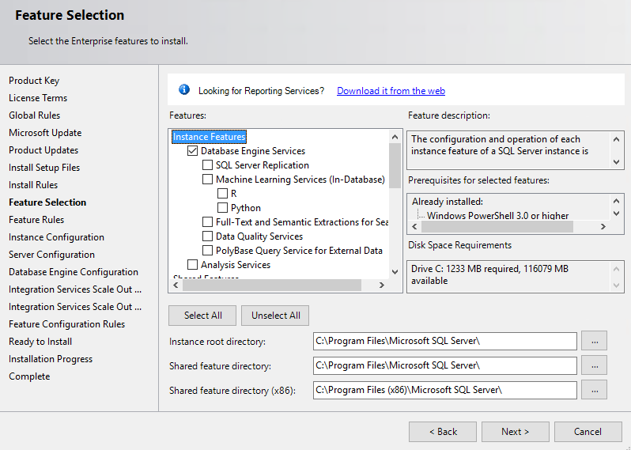
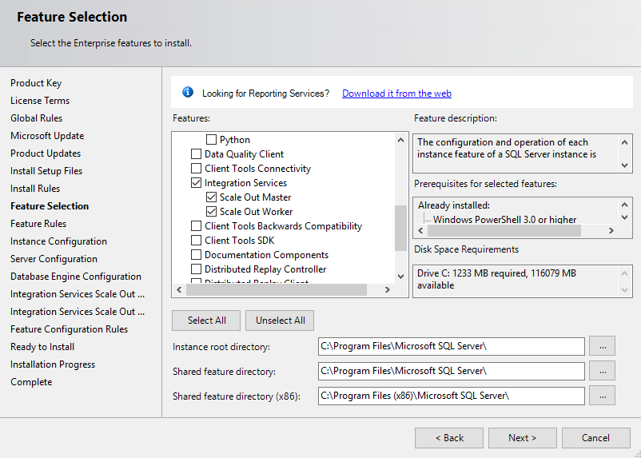
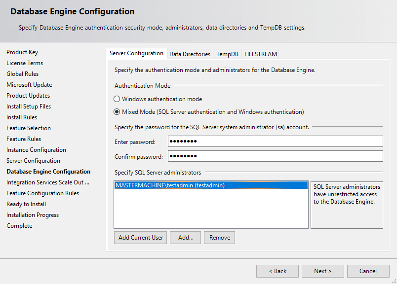
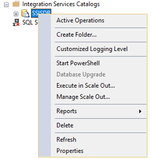

# Get started with Integration Services (SSIS) Scale Out on a single computer
This section provides the guidance of setting up Integration Services Scale Out in an one-box environment with default settings.

## 1. Install SQL Server features
In the SQL Server installation wizard, select Database Engine Services, Integration Services, Scale Out Master and Scale Out Worker on the **Feature Selection** page.

On the **Server Configuration** page, simply click "Next" to use default service accounts and startup types.

On the **Database Engine Configuration** page, select "**Mixed Mode**" and click "**Add Current User**" button. 

One the **Integration Services Scale Out Configuration - Master Node** and **Integration Services Scale Out Configuration - Worker Node** pages, simply click "Next" to apply the default settings of port and certificates.

Finish the SQL Server installation Wizard.

## 2. Install SQL Server Management Studio

[Download](../../ssms/download-sql-server-management-studio-ssms.md)  SQL Server Management Studio and install it.

## 3. Enable Scale Out
Open SSMS and connect to the local Sql Server instance.
Right-click **Integration Services Catalogs** in the object explorer and select **Create Catalog**.

In the **Create Catalog** dialog, **Enable this server as SSIS scale out master** is selected by default. Just create the catalog as usual. 

## 4. Enable Scale Out Worker
In SSMS, right-click **SSISDB** and select **Manage Scale Out...**. 

The Integration Services Scale Out Manager will pop up. You can manage Scale Out with it. For more information, see [Integration Services Scale Out Manager](integration-services-ssis-scale-out-manager.md).

To enable the Scale Out Worker, switch to **Worker Manager** and select the worker you want to enable. The worker is originally disabled. Click **Enable Worker** to enable it.

## 5. Run packages in Scale Out
Now, you are ready to run SSIS packages in Scale Out. See [Run Packages in Integration Services (SSIS) Scale Out](run-packages-in-integration-services-ssis-scale-out.md).

To add more Scale Out workers, see [Add a Scale Out Worker with Scale Out Manager](add-scale-out-worker.md).
